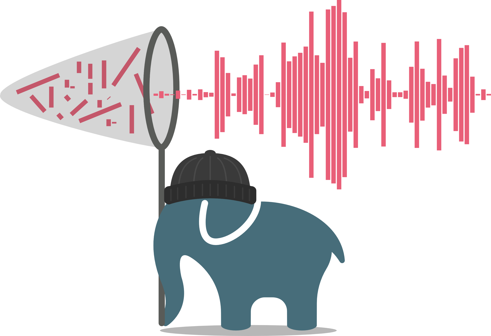

# WaveFake: A Data Set to Facilitate Audio DeepFake Detection


This is the code repository for our NeurIPS 2021 (Track on Datasets and Benchmarks) [paper](https://arxiv.org/abs/2111.02813) WaveFake.

<p>
 
</p>

>Deep generative modeling has the potential to cause significant harm to society.
>Recognizing this threat, a magnitude of research into detecting so-called "Deepfakes" has emerged.
>This research most often focuses on the image domain, while studies exploring generated audio signals have - so far - been neglected.
>In this paper, we aim to narrow this gap.
>We present a novel data set, for which we collected ten sample sets from six different network architectures, spanning two languages.
>We analyze the frequency statistics comprehensively, discovering subtle differences between the architectures, specifically among the higher frequencies.
>Additionally, to facilitate further development of detection methods, we implemented three different classifiers adopted from the signal processing community to give practitioners a baseline to compare against.
>In a first evaluation, we already discovered significant trade-offs between the different approaches.
>Neural network-based approaches performed better on average, but more traditional models proved to be more robust.

# Dataset & Pre-trained Models

You can find our dataset on [zenodo](https://zenodo.org/record/5642694) and we also provide [pre-trained models](https://ruhr-uni-bochum.sciebo.de/s/Aqw3PKXMZMbWBPE).

## Setup

You can install all needed dependencies by running:

```
pip install -r requirements.txt
```

#### RawNet2 Model
For consistency, we use the RawNet2 model provided by the ASVSpoof 2021 challenge. 
Please download the model specifications [here](https://github.com/asvspoof-challenge/2021/tree/main/LA/Baseline-RawNet2) and place it under `dfadetect/models` as `raw_net2.py`.

## Statistics & Plots

To recreate the plots/statistics of the paper, use:

```
python statistics.py -h

usage: statistics.py [-h] [--amount AMOUNT] [--no-stats] [DATASETS ...]

positional arguments:
  DATASETS              Path to datasets. The first entry is assumed to be the referrence one. Specified as follows <path,name>

optional arguments:
  -h, --help            show this help message and exit
  --amount AMOUNT, -a AMOUNT
                        Amount of files to concider.
  --no-stats, -s        Do not compute stats, only plots.
```

**Example**

`python statistics.py /path/to/reference/data,ReferenceDataName /path/to/generated/data,GeneratedDataName  -a 10000`


## Training models

You can use the training script as follows:

```
python train_models.py -h

usage: train_models.py [-h] [--amount AMOUNT] [--clusters CLUSTERS] [--batch_size BATCH_SIZE] [--epochs EPOCHS] [--retraining RETRAINING] [--ckpt CKPT] [--use_em] [--raw_net] [--cuda] [--lfcc] [--debug] [--verbose] REAL FAKE

positional arguments:
  REAL                  Directory containing real data.
  FAKE                  Directory containing fake data.

optional arguments:
  -h, --help            show this help message and exit
  --amount AMOUNT, -a AMOUNT
                        Amount of files to load from each directory (default: None - all).
  --clusters CLUSTERS, -k CLUSTERS
                        The amount of clusters to learn (default: 128).
  --batch_size BATCH_SIZE, -b BATCH_SIZE
                        Batch size (default: 8).
  --epochs EPOCHS, -e EPOCHS
                        Epochs (default: 5).
  --retraining RETRAINING, -r RETRAINING
                        Retraining tries (default: 10).
  --ckpt CKPT           Checkpoint directory (default: trained_models).
  --use_em              Use EM version?
  --raw_net             Train raw net version?
  --cuda, -c            Use cuda?
  --lfcc, -l            Use LFCC instead of MFCC?
  --debug, -d           Only use minimal amount of files?
  --verbose, -v         Display debug information?
```

**Example**

To train all EM-GMMs use:

`python train_models.py /data/LJSpeech-1.1/wavs /data/generated_audio -k 128 -v --use_em --epochs 100`


## Evaluation

For evaluation you can use the evaluate_models script:

```
python evaluate_models.p -h

usage: evaluate_models.py [-h] [--output OUTPUT] [--clusters CLUSTERS] [--amount AMOUNT] [--raw_net] [--debug] [--cuda] REAL FAKE MODELS

positional arguments:
  REAL                  Directory containing real data.
  FAKE                  Directory containing fake data.
  MODELS                Directory containing model checkpoints.

optional arguments:
  -h, --help            show this help message and exit
  --output OUTPUT, -o OUTPUT
                        Output file name.
  --clusters CLUSTERS, -k CLUSTERS
                        The amount of clusters to learn (default: 128).
  --amount AMOUNT, -a AMOUNT
                        Amount of files to load from each directory (default: None - all).
  --raw_net, -r         RawNet models?
  --debug, -d           Only use minimal amount of files?
  --cuda, -c            Use cuda?
```

**Example**

` python evaluate_models.py /data/LJSpeech-1.1/wavs /data/generated_audio trained_models/lfcc/em`

Make sure to move the out-of-distribution models to a seperate directory first!

## Attribution

We provide a script to attribute the GMM models:
```
python attribute.py -h

usage: attribute.py [-h] [--clusters CLUSTERS] [--steps STEPS] [--blur] FILE REAL_MODEL FAKE_MODEL

positional arguments:
  FILE                  Audio sample to attribute.
  REAL_MODEL            Real model to attribute.
  FAKE_MODEL            Fake Model to attribute.

optional arguments:
  -h, --help            show this help message and exit
  --clusters CLUSTERS, -k CLUSTERS
                        The amount of clusters to learn (default: 128).
  --steps STEPS, -m STEPS
                        Amount of steps for integrated gradients.
  --blur, -b            Compute BlurIG instead.
```

**Example**

`python attribute.py /data/LJSpeech-1.1/wavs/LJ008-0217.wav  path/to/real/model.pth path/to/fake/model.pth`

# BibTeX

When you cite our work feel free to use the following bibtex entry:
```
@inproceedings{
  frank2021wavefake,
  title={{WaveFake: A Data Set to Facilitate Audio Deepfake Detection}},
  author={Joel Frank and Lea Sch{\"o}nherr},
  booktitle={Thirty-fifth Conference on Neural Information Processing Systems Datasets and Benchmarks Track},
  year={2021},
}
```
